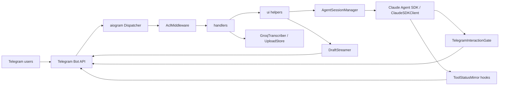
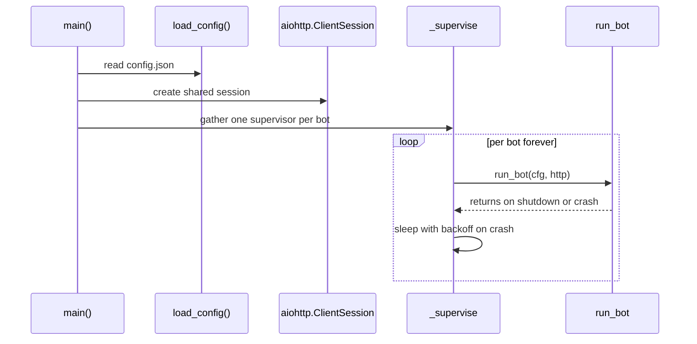
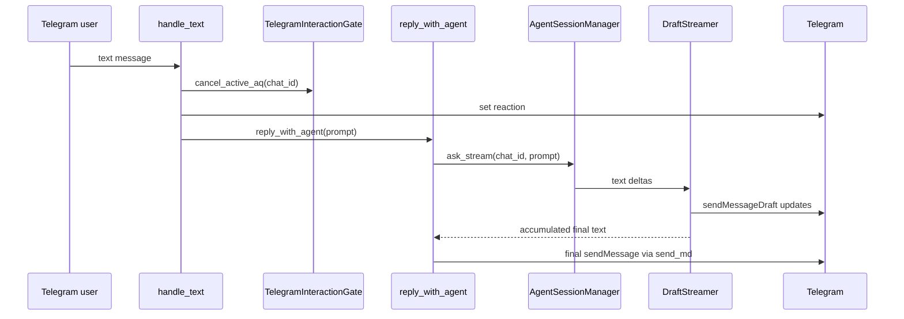

# Application Architecture

This document describes the current architecture of `agent-bot`. If this
document and the code disagree, the code in `src/` is the source of truth.

## 1. Purpose

`agent-bot` is a multi-bot Telegram gateway for Claude Agent SDK. One Python
process can run multiple Telegram bots concurrently, one per entry in
`src/config/config.json`. Each bot receives Telegram updates, enforces access
control, handles optional voice and file workflows, then forwards user prompts
to a live Claude SDK session.

The central architectural rule is separation of concerns. `src/bot.py` wires
dependencies and starts polling; feature behavior lives in `handlers/`, `ui/`,
`infra/`, and `services/`.

## 2. High-Level Diagram



Main dependencies:

- `aiogram` for long polling, message routing, and callback query routing.
- `claude-agent-sdk` for live agent sessions, tool permissions, hooks,
  context usage, MCP status, and server info.
- `aiohttp` for the shared HTTP client used by Telegram draft calls and Groq.
- `pydantic` for strict configuration validation.

## 3. Source Layout

```text
src/
  bot.py                  dependency wiring, supervisor, entry point
  config/                 BotConfig and config.json loader
  handlers/               aiogram handlers for commands and inputs
  i18n/                   Translator and JSON locale files
  infra/                  SDK sessions, gate, commands, streaming, logs
  services/               external APIs and upload storage
  ui/                     Telegram-facing helpers and middleware
tests/                    unit tests for pure logic and factories
docs/                     architecture documentation
```

Responsibilities:

- `handlers/` accepts Telegram events and chooses the scenario.
- `ui/` contains Telegram-side pipelines and helpers: replies, markdown
  rendering, reactions, ACL middleware, plan routing, album debounce, and
  tool status mirroring.
- `infra/` contains SDK-facing and runtime infrastructure: Claude sessions,
  the permission gate, custom command loading, logs, and draft streaming.
- `services/` encapsulates external APIs and filesystem-backed upload state.

## 4. Process Startup and Multi-Bot Runtime

The runtime entry point is `src/bot.py`.

1. `_cli()` calls `asyncio.run(main())`.
2. `main()` initializes console logging through `setup_console()`.
3. `load_config()` reads `src/config/config.json`.
4. A shared `aiohttp.ClientSession` is created.
5. One `_supervise(cfg, http)` task is started for each `BotConfig`.
6. `_supervise` runs `run_bot` in a loop and restarts crashed bots with
   exponential backoff from 1 to 60 seconds.



Each bot owns its own:

- aiogram `Bot` and `Dispatcher`;
- `BotContext`;
- `AgentSessionManager`;
- `TelegramInteractionGate`;
- `DraftStreamer`;
- `ToolStatusMirror`;
- `BotLogs`;
- `PlanRouter`;
- `AlbumDebouncer`;
- optional `GroqTranscriber`;
- optional `UploadStore`.

Only the `aiohttp.ClientSession` is shared across bots.

## 5. Configuration

`src/config/__init__.py` defines `BotConfig` and the `load()` function.

Normal config format:

```json
{
  "internal_name": {
    "telegram_bot_token": "...",
    "working_dir": "/path/to/project",
    "logs_dir": "logs",
    "uploads_dir": "uploads",
    "commands_dir": "commands",
    "allowed_chat_ids": [123],
    "allowed_for_all": false
  }
}
```

The loader also supports the legacy flat format. If the top-level object has
`telegram_bot_token`, it is wrapped under the bot name `default`.

Config normalization:

- `telegram_bot_token` comes from the field or
  `TELEGRAM_BOT_TOKEN_<INTERNAL_NAME>`.
- `groq_api_key` comes from the field, `GROQ_API_KEY_<INTERNAL_NAME>`, or
  `GROQ_API_KEY`.
- `working_dir` and `commands_dir` must exist when configured.
- `logs_dir` and `uploads_dir` are created automatically when configured.
- `allowed_chat_ids` and `blacklist_chat_ids` are normalized to tuples of int.
- Unknown fields are rejected by `extra="forbid"`.

`BotConfig` is frozen, so runtime code does not mutate loaded config.

## 6. Per-Bot Dependency Graph

`run_bot(cfg, http)` creates dependencies in this order:

1. `_make_bot(cfg)` creates an aiogram `Bot` with HTML parse mode defaults.
2. `bot.get_me()` resolves the Telegram username for logs.
3. `_make_logs(cfg)` creates general and per-chat loggers.
4. `Translator(cfg.lang)` and `system_prompt` are resolved.
5. `ReactionPicker` is created from translations.
6. `_make_acl(cfg, glog)` creates the fail-closed predicate.
7. `DraftStreamer` is created.
8. `TelegramInteractionGate` is created.
9. `ToolStatusMirror` is created.
10. `AgentSessionManager` is created.
11. Optional `GroqTranscriber` is created.
12. Optional `UploadStore` is created.
13. `PlanRouter` is created.
14. `AlbumDebouncer` is created.
15. Custom slash commands are loaded.
16. `BotContext` is assembled.
17. `Dispatcher`, `AclMiddleware`, and all handlers are registered.

After handler registration, the bot publishes its Telegram command list with
`bot.set_my_commands()` and starts `dp.start_polling(bot)`.

## 7. BotContext

`handlers/context.py` defines the frozen `BotContext` dataclass. It is the
shared dependency object injected into every handler by middleware.

It contains:

- config and aiogram `Bot`;
- translator;
- general and per-chat logs;
- `AgentSessionManager`;
- `TelegramInteractionGate`;
- `DraftStreamer`;
- `ReactionPicker`;
- optional transcriber and uploads store;
- `PlanRouter`;
- `AlbumDebouncer`;
- Telegram command list;
- `is_allowed` predicate.

This keeps `bot.py` free of handler-specific closures and makes handler
signatures consistent: `ctx`, `cl`, and `chat_id` come from middleware.

## 8. Access Control

ACL is built in `bot._make_acl` and enforced by `ui/middleware.py`.

Fail-closed order:

1. If `chat_id` is in `blacklist_chat_ids`, deny.
2. If `allowed_for_all=true`, allow every non-blacklisted chat.
3. Otherwise, allow only `allowed_chat_ids`.

`AclMiddleware` runs as outer middleware for messages and callback queries:

- injects `ctx`;
- extracts `chat_id`;
- injects `chat_id` and per-chat logger `cl`;
- denies unauthorized messages;
- answers unauthorized callback queries with an alert.

Gate-managed callbacks with `perm:`, `aq:`, and `plan:` bypass the generic
ACL. The gate validates prompt ownership itself.

`/mode` and `/model` callbacks embed `chat_id` in callback data and verify
that it matches the callback message chat.

## 9. Handler Registration

`handlers/__init__.py:register_all` registers handlers in this order:

1. `selectors.register` for `/mode` and `/model`.
2. `basic.register` for `/start`, `/new`, `/cancel`, `/context`, `/stop`,
   `/mcp`, `/info`, `/whoami`, and `/help`.
3. `plan.register` for `/plan` and gate callbacks.
4. `custom.register` for user-defined slash commands.
5. `text.register` for the greedy `F.text` catch-all.
6. `voice.register` for `F.voice | F.audio`.
7. `uploads.register` for `F.photo`, `F.document`, and `F.sticker`.

The order matters because `F.text` is greedy. Custom commands must be
registered before the catch-all text handler.

## 10. Text Flow

`handlers/text.py` has three branches:

1. Pending `ExitPlanMode`: text is treated as rejection feedback.
   `gate.consume_plan_text()` resolves the plan future and no new agent turn
   starts.
2. Armed `/plan`: text becomes the plan prompt.
3. Normal message: cancel active AskUserQuestion, react, run the agent turn.

Normal text flow:



`reply_with_agent` also drains pending uploads from `UploadStore` and prepends
absolute file paths to the prompt.

## 11. Agent Sessions

`infra/agent.py:AgentSessionManager` owns `ClaudeSDKClient` sessions per
Telegram chat.

State:

- `_clients: dict[int, tuple[ClaudeSDKClient, float]]`;
- `_locks: dict[int, asyncio.Lock]`;
- `_modes: dict[int, str]`;
- `_models: dict[int, str | None]`;
- optional idle GC task.

Each `chat_id` has at most one live client. Turns in the same chat are
serialized by a per-chat lock so one `ClaudeSDKClient` is not used
concurrently. Different chats can run in parallel.

When a client is created, `AgentSessionManager` passes these SDK options:

- `system_prompt`;
- `include_partial_messages=True`;
- `can_use_tool`;
- `cwd`;
- `add_dirs`;
- `setting_sources=["user", "project", "local"]`;
- `PreToolUse` and `PostToolUse` hooks.

Important methods:

- `ask_stream` - primary streaming API for Claude replies.
- `ask` - non-streaming helper.
- `get_context_usage`.
- `get_mcp_status`.
- `get_server_info`.
- `set_permission_mode`.
- `set_model`.
- `interrupt`.
- `reset`.
- `close_all`.

`reset(chat_id)` closes the SDK client, clears mode/model mirrors, and removes
the lock. `close_all()` is used during shutdown.

Idle GC closes sessions that have been idle longer than
`session_idle_ttl_sec`. A value of `0` disables GC.

## 12. Reply Streaming

Claude replies arrive from `ask_stream` as delta chunks. `DraftStreamer`
accepts an async iterator of deltas, accumulates text locally, and
periodically calls Telegram raw method `sendMessageDraft`.

Properties:

- drafts are ephemeral and do not enter chat history;
- the final message is sent separately through `send_md`;
- draft text is limited to the last 4000 characters;
- update frequency is controlled by `draft_interval_sec`;
- the bot token is redacted from draft error logs through `_redact`.

`reply_with_agent` wraps streaming in `asyncio.wait_for` using
`agent_timeout_sec`.

## 13. Markdown Rendering and Sending

`ui/markdown.py` converts Markdown to Telegram HTML using `markdown-it-py`
tokens plus a small custom renderer.

Supported output:

- headings rendered as bold paragraphs;
- bold, italic, strikethrough;
- inline code;
- fenced code blocks;
- bullet and ordered lists;
- blockquotes;
- links;
- raw HTML stripped and escaped.

`send_md_to_chat` first sends converted HTML in chunks up to 4000 characters.
If Telegram rejects an HTML chunk, it sends the original plain text instead so
the user does not see escaped or malformed HTML.

Current trade-off: chunking happens after HTML conversion. If a chunk splits
inside an HTML tag, Telegram may reject it and the full response falls back to
plain text.

## 14. Permission Gate

`infra/interactions/gate.py:TelegramInteractionGate` adapts SDK
`can_use_tool` to Telegram UI.

`AgentSessionManager` registers an SDK callback that adds `chat_id` and
delegates to `gate.can_use_tool(chat_id, tool_name, tool_input, ctx)`.

Gate routing:

- `AskUserQuestion` - special multi-question flow.
- `ExitPlanMode` - plan approval/rejection flow.
- `PushNotification` - one-shot notification delivery.
- every other tool - generic Allow/Deny/Always allow prompt.

### 14.1 Generic Permission Prompt

`permission_prompt.py` sends an inline keyboard:

- Allow;
- Deny;
- Always allow this session.

Request state lives in `_pending`:

```text
request_id -> (future, tool_name, expected_chat_id, prompt_message_id)
```

On click:

- request freshness is checked;
- callback chat is checked against the expected chat;
- the future is resolved with the decision;
- the prompt is deleted;
- the verdict is written to the per-chat log.

Timeout resolves as deny and deletes the prompt. `Always allow this session`
returns `PermissionResultAllow` with
`PermissionUpdate(destination="session")`.

### 14.2 AskUserQuestion

`ask_user_question.py` turns SDK `AskUserQuestion` calls into Telegram inline
keyboards.

Supported behavior:

- single-select questions;
- multi-select questions with toggle buttons and Done;
- Skip;
- timeout;
- auto-abort when the user sends a new message through
  `gate.cancel_active_aq`.

The answer is returned to Claude through `PermissionResultDeny.message`. This
is intentionally used as a textual tool result for the model.

### 14.3 ExitPlanMode

`plan_mode.py` handles SDK `ExitPlanMode`.

Flow:

1. The plan is sent as a separate Markdown-rendered Telegram HTML message.
2. A compact prompt with Approve / Reject buttons is sent afterwards.
3. Approve returns `PermissionResultAllow`.
4. Reject returns a deny message and keeps Claude in plan mode.
5. Any text while the prompt is active is treated as rejection with feedback.

State lives in `_plan_pending`:

```text
chat_id -> (future, request_id, prompt_message_id)
```

### 14.4 PushNotification

`push_notification.py` sends a plain text notification and returns a delivery
message to Claude. It uses `PermissionResultDeny.message` because the SDK
feeds that message back as the tool result.

## 15. Plan Mode

Plan mode has two cooperating pieces:

- `ui/plan_router.py` tracks armed chats and switches SDK permission mode to
  `"plan"`.
- `infra/interactions/plan_mode.py` handles approval and rejection of
  `ExitPlanMode`.

Entry points:

- `/plan <prompt>` switches to plan mode and immediately runs a turn.
- `/plan` arms the chat; the next text or transcribed voice message becomes
  the plan prompt.

`PlanRouter.fire`:

1. cancels active AskUserQuestion;
2. calls `agent.set_permission_mode(chat_id, "plan")`;
3. tells the user plan mode is engaged;
4. sets a reaction;
5. runs the normal `reply_with_agent` pipeline.

`/cancel` clears only the armed `/plan` state. `/new` resets the session,
disarms the plan router, and cancels active AskUserQuestion.

## 16. Voice and Audio

`handlers/voice.py` handles `F.voice | F.audio`.

Flow:

1. Cancel active AskUserQuestion.
2. If `GroqTranscriber` is absent, send `voice_disabled`.
3. Check `voice_max_duration_sec`.
4. Download the file into `SpooledTemporaryFile`; files up to 4 MB stay in
   memory, larger files spill to disk.
5. `GroqTranscriber.transcribe` posts audio to Groq
   `audio/transcriptions`.
6. The transcript is echoed to the user as a blockquote.
7. If `/plan` is armed, the transcript becomes the plan prompt.
8. Otherwise, the transcript enters the normal agent flow.

`audio_filename` chooses an extension from Telegram media type and MIME so
Groq can dispatch the format correctly.

## 17. Uploads, Stickers, and Albums

`handlers/uploads.py` handles:

- `F.photo`;
- `F.document`;
- `F.sticker`.

If `uploads_dir` is not configured, the feature is disabled.

Save flow:

1. Check `upload_max_bytes`.
2. Download the file to
   `<uploads_dir>/<chat_id>/<timestamp>_<file_id_prefix>_<safe_name>`.
3. Create a `PendingFile`.
4. Add it to the per-chat pending queue in `UploadStore`.
5. Let `AlbumDebouncer` decide whether to fire immediately or wait for the
   end of a media group.

`UploadStore` does not pass bytes directly to Claude. Before an agent turn,
`reply_with_agent` calls `pop_pending(chat_id)` and prepends absolute paths to
the prompt:

```text
The user attached the following files (use the Read tool to inspect them):
  1. /abs/path/file.jpg (image, original name: photo.jpg)

User message:
...
```

Telegram albums arrive as separate updates sharing the same `media_group_id`.
`AlbumDebouncer` resets a timer on each item and runs one agent turn after
about 1.5 seconds of quiet time.

Sticker handling:

- static `.webp` -> `kind="image"`;
- animated `.tgs` -> binary Lottie JSON;
- video `.webm` -> binary video sticker.

## 18. Custom Slash Commands

`infra/commands.py` loads `*.md` files from `commands_dir`.

Command file example:

```markdown
---
name: recall
description: Search project memory
---
Use the project memory to answer: $ARGUMENTS
```

Rules:

- command name comes from frontmatter `name` or the file stem;
- name must satisfy Telegram command regex;
- built-in commands cannot be overridden;
- duplicates are skipped;
- empty bodies are skipped;
- file size is capped at 1 MB;
- description is capped at 256 characters.

When the command runs, `handlers/custom.py` replaces `$ARGUMENTS` with the
text after the slash command, cancels active AskUserQuestion, and runs the
normal agent flow through `reply_with_agent`.

Commands are loaded only at startup. Restart the bot to pick up changes.

## 19. Mode and Model Selectors

`handlers/selectors.py` implements `/mode` and `/model`.

`/mode` values:

- `default`;
- `acceptEdits`;
- `plan`.

`/model` values:

- `claude-opus-4-7`;
- `claude-sonnet-4-6`;
- `claude-haiku-4-5`;
- default.

Without an argument, each command shows an inline keyboard. With an argument,
the value is applied directly. Values are sent to the live SDK client through
`AgentSessionManager.set_permission_mode` and `set_model`, preserving session
context.

The SDK has no public getter for current mode/model, so the manager keeps
mirrors in `_modes` and `_models`. They are used by `/whoami` and selector
keyboards.

## 20. Tool Status Mirror

`ui/tool_status.py:ToolStatusMirror` receives events from SDK hooks.

`AgentSessionManager._make_options` registers:

- `PreToolUse` with matcher `None` for every tool;
- `PostToolUse` with matcher `"Monitor|TaskOutput"`.

Pre-hook sends a short plain text "tool started" message to Telegram.
Gate-managed tools (`AskUserQuestion`, `ExitPlanMode`, `PushNotification`)
are skipped because the gate already renders their UX.

Post-hook shows tail output for `Monitor` and `TaskOutput`: up to 6 lines and
600 characters.

Tool status messages are sent with `disable_notification=True`.

## 21. Logging

`infra/logs.py` implements `BotLogs`.

Layout when `logs_dir` is configured:

```text
<logs_dir>/<internal_name>/bot.log
<logs_dir>/<internal_name>/<chat_id>.log
```

`bot.log` is the general bot log and propagates to the root console handler.

`<chat_id>.log` is the audit trail for one chat:

- user prompts;
- transcripts;
- agent replies;
- permission decisions;
- AskUserQuestion answers;
- plan approve/reject events;
- upload saves;
- album fires;
- tool hook events;
- errors.

Logs rotate through `RotatingFileHandler`: 10 MB with 5 backups.

Per-chat loggers are cached in an LRU with capacity `chat_logger_capacity`.
When a logger is evicted, its handlers are closed to release file descriptors.

If `logs_dir` is unset, `for_chat` returns a noop logger.

## 22. i18n

`src/i18n/__init__.py` provides `Translator(lang)`. JSON locale files live in
`src/i18n/<lang>.json`.

`Translator.t(key, **kwargs)`:

- looks up the key in the selected language;
- falls back to the default language;
- returns the key itself if no translation exists;
- applies `str.format`.

All user-facing strings should go through the translator. Exceptions are
protocol text sent to Claude and low-level technical strings that are part of
SDK/tool contracts.

`system_prompt` is separate from `lang`: `lang` controls Telegram UI strings,
while Claude's reply language is controlled by `system_prompt` or fallback
`default_system_prompt`.

## 23. Error Handling and Resilience

Main safeguards:

- supervisor restarts crashed bot polling loops;
- ACL is fail-closed;
- per-chat locks prevent concurrent use of one SDK client;
- timeouts exist for approvals, Groq transcription, and agent turns;
- Markdown rendering falls back to plain text;
- draft failures are logged but do not break the final reply;
- upload download errors remove partial files;
- the gate deletes stale inline prompts;
- `/stop` calls SDK interrupt without taking the per-chat lock.

At process level, `CancelledError` is not swallowed, so Ctrl-C and normal
shutdown work correctly.

## 24. Security Model

Critical invariants:

- Agent flow is reachable only through `AclMiddleware`.
- New handlers should accept `ctx`, `cl`, and `chat_id` via middleware and
  must not bypass ACL.
- Gate callbacks validate prompt ownership.
- `/mode` and `/model` callbacks validate embedded `chat_id`.
- Telegram bot token is redacted from draft error logs.
- Upload filenames are sanitized.
- `working_dir` must exist at config load time.
- SDK permissions use `setting_sources=["user", "project", "local"]`.
- Persistent allow rules belong in `.claude/settings.local.json`, not code.

Sensitive data:

- chat logs contain user messages, agent replies, and uploaded file paths;
- uploads store real user files;
- config may contain tokens when they are not moved to environment variables.

## 25. Test Boundaries

Unit tests cover pure and relatively isolated logic:

- config loading and env overrides;
- ACL factory and bot command list;
- custom command parser;
- i18n fallback;
- upload store and prompt formatting;
- Markdown-to-HTML rendering;
- reaction picker;
- plan router state;
- logs LRU behavior;
- SDK view formatting;
- draft token redaction.

Not fully covered by unit tests:

- live aiogram dispatcher wiring;
- real Telegram API calls;
- live Claude Agent SDK turns;
- Groq API;
- draft rendering in Telegram;
- real permission callbacks end to end.

Recommended checks for significant changes:

```bash
find src -name '*.py' -not -path '*/__pycache__/*' -print0 | xargs -0 python -m py_compile
pytest -q
```

For integration-heavy changes, also run the bot and verify the affected
Telegram scenario by reading `logs/<internal_name>/bot.log` and
`logs/<internal_name>/<chat_id>.log`.

## 26. Extension Guide

### New Telegram Handler

1. Add the function to an existing `handlers/` module or create a new module.
2. Accept `ctx: BotContext`, `cl: logging.Logger`, and `chat_id: int` when
   needed.
3. Register it in the right order in `handlers/__init__.py`.
4. Do not bypass `AclMiddleware`.
5. Add user-facing strings to i18n JSON.
6. If the handler starts a Claude turn, use `react_to` and
   `reply_with_agent` to preserve uploads, streaming, timeout handling, and
   logging.

### New SDK Special Tool Flow

1. Add a module under `infra/interactions/`.
2. Add a branch to `TelegramInteractionGate.can_use_tool`.
3. If the flow renders its own UX, add the tool to `_GATE_HANDLED_TOOLS` in
   `ui/tool_status.py`.
4. Store pending state with request ID and expected chat ID.
5. Delete stale prompts on click and timeout.
6. Log decisions through `gate._cl(chat_id)`.

### New External Integration

1. Encapsulate the API in `services/`.
2. Create the client in `bot.py` through a small `_make_*` factory.
3. Pass the dependency through `BotContext`.
4. Add config fields to `BotConfig` and `CONFIG.md`.
5. Cover pure logic with unit tests.

## 27. Architectural Trade-Offs

### One Process, Multiple Bots

Pros: simple operations, one event loop, shared HTTP pool.
Cons: a process-level failure affects all bots; heavy work in one bot can
affect others through the shared event loop.

### Per-Chat Live SDK Sessions

Pros: multi-turn context survives and mode/model changes do not reset context.
Cons: live clients consume resources and require idle GC.

### Middleware-Injected BotContext

Pros: handlers stay small and dependencies are centralized.
Cons: middleware registration mistakes surface as runtime handler signature
errors.

### Telegram Permission Gate

Pros: users approve tools in the same interface where they chat.
Cons: tool execution depends on Telegram latency and user callbacks; timeouts
and stale prompt cleanup are mandatory.

### Uploads as Filesystem Paths

Pros: Claude can inspect uploads with standard tools; no custom binary bridge
is needed.
Cons: `add_dirs`, file retention, and upload privacy need operational care.

## 28. Scenario Map

| Scenario | Main modules |
|---|---|
| Normal text | `handlers/text.py`, `ui/agent_reply.py`, `infra/agent.py`, `infra/streaming.py` |
| `/plan` | `handlers/plan.py`, `ui/plan_router.py`, `infra/interactions/plan_mode.py` |
| Tool permission | `infra/agent.py`, `infra/interactions/gate.py`, `permission_prompt.py` |
| AskUserQuestion | `ask_user_question.py`, `handlers/text.py` |
| Voice | `handlers/voice.py`, `services/transcribe.py`, `ui/markdown.py` |
| Photo/file | `handlers/uploads.py`, `services/upload_store.py`, `ui/album.py` |
| `/mode` and `/model` | `handlers/selectors.py`, `infra/agent.py` |
| `/context`, `/mcp`, `/info` | `handlers/basic.py`, `ui/sdk_views.py`, `infra/agent.py` |
| Logs | `infra/logs.py`, all handlers through `cl` |
| Custom commands | `infra/commands.py`, `handlers/custom.py` |

